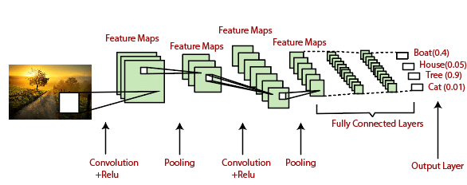
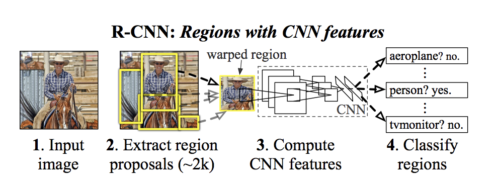
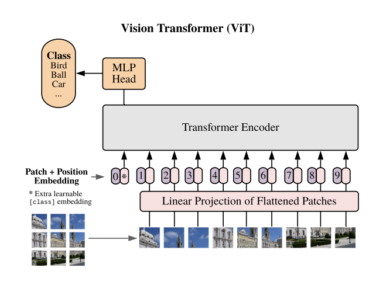
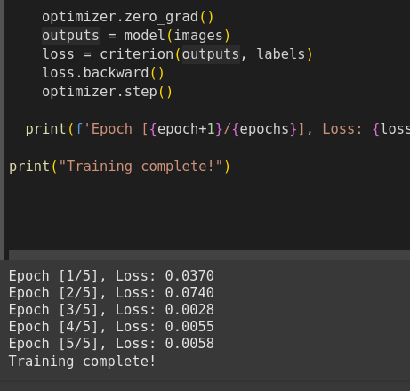
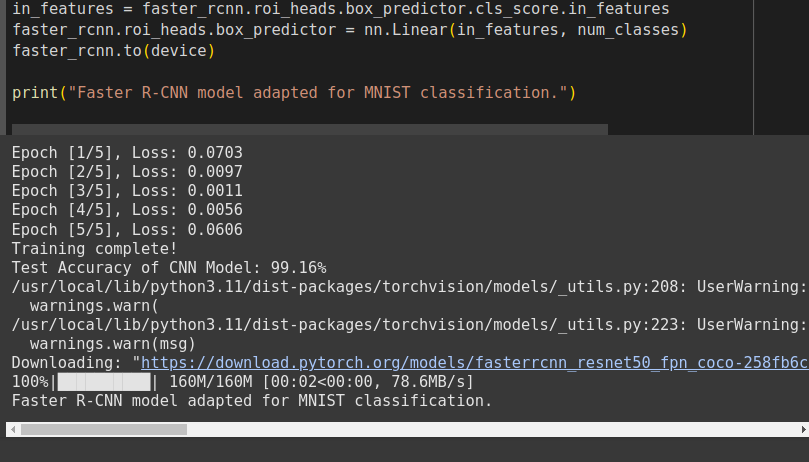

# Deep Learning Homework - Lab 2

## Objective
The goal of this lab is to get familiar with **PyTorch** by implementing various neural network architectures for **computer vision**, including:
- **CNN** for MNIST classification
  
- **Faster R-CNN** for adapted object detection/classification on MNIST
  
- **Vision Transformer (ViT)** for MNIST classification


We will compare their performances using metrics like **accuracy, F1-score, loss, and training time**.

---

## Part 1: CNN Classifier
### Dataset
- We use the **MNIST dataset** from Kaggle: [MNIST Dataset](https://www.kaggle.com/datasets/hojjatk/mnist-dataset).
- Preprocessed using **torchvision.transforms** (normalized images).

### CNN Architecture
- **Convolutional Layers**: 2 layers with ReLU activations
- **Pooling**: Max Pooling
- **Fully Connected Layer**: 128 neurons, outputting 10 classes
- **Optimizer**: Adam
- **Loss Function**: CrossEntropyLoss
- **Evaluation**: Accuracy computed on test set

### Results
- CNN model is trained for **5 epochs**



- Accuracy is displayed after evaluation

---

## Part 2: Faster R-CNN Classifier
### Dataset Adaptation
- MNIST is converted into an **object detection dataset** by adding **bounding boxes**.
- Labels are modified to fit the Faster R-CNN structure.



### Model Architecture
- **Pretrained Faster R-CNN** (`fasterrcnn_resnet50_fpn`)
- Modified **classification head** to detect **10 digits + background**

### Next Steps
- Train Faster R-CNN model on the adapted MNIST dataset
- Compare it with CNN in terms of accuracy, F1-score, and speed

---

## Part 3: Vision Transformer (ViT)
### Model Implementation
- Followed [this tutorial](https://medium.com/mlearning-ai/vision-transformers-from-scratch-pytorch-a-step-by-step-guide-96c3313c2e0c)
- Implemented ViT from scratch
- Used MNIST dataset for training

### Comparison
- Performance metrics compared with CNN and Faster R-CNN

---

## Conclusion
- Summary of findings from all models
- Which performed better for MNIST and why

---

## Repository Structure
```
|-- data/                  # Dataset
|-- models/                # Model implementations (CNN, Faster R-CNN, ViT)
|-- training/              # Training scripts
|-- evaluation/            # Performance metrics
|-- README.md              # This file
|-- requirements.txt       # Dependencies
```

## How to Run
1. Install dependencies:
   ```bash
   pip install -r requirements.txt
   ```
2. Run the CNN model:
   ```bash
   python models/cnn.py
   ```
3. Run the Faster R-CNN model:
   ```bash
   python models/faster_rcnn.py
   ```
4. Run the Vision Transformer model:
   ```bash
   python models/vit.py
   ```

---

## Tools Used
- **Google Colab** / **Kaggle** for training
- **PyTorch** for deep learning models
- **GitHub** for version control

## Author
**Mouaad ELHANSALI**

